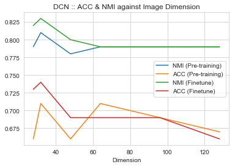

# Deep Clustering Network (DCN)

This work is a modified codebase of: https://github.com/devyhia/DCN-New

## What is different?
1. We added a Dockerfile that contains the environment for which this trains and evaluates.
2. We added the ability to train the COIL-20 dataset.
3. We fine-tuned the hyperparameters for the network to obtain the best possible performance on COIL-20 dataset using this network.

## How to train the network?

1. Install Docker with Nvidia GPU support. This could be done following this tutorial: https://github.com/NVIDIA/nvidia-docker
2. Build the docker image using the following snippet:
```
docker build -t dcn .
```
3. Open the docker image (i.e. bash into it).
```
docker run --runtime=nvidia --rm dcn bash
```
3. Inside the bash, start training the network using the following snippet.
```
THEANO_FLAGS='floatX=float32,device=cuda,dnn.enabled=False' python run_raw_coil20.py
```

## Features Generation

The above script is using a pre-made feature files (i.e. *`.npy` files). These files are numpy arrays that has the following format:
```
features.shape  ==    (1400, DIM * DIM)
labels.shape    ==    (1400, 1)
```

## Network fine-tuning



I fine-tuned the DCN model and obtained a higher ACC & NMI.

```
Before Fine-tuning:     ACC= 0.71, NMI= 0.79
After Fine-tuning:      ACC= 0.74, NMI= 0.83
```

### Important Information:
- DCN is multi-layer perceptron network.
- Authors split training into two stages: layer-wise pre-training and end-to-end fine-tuning. After layer-wise training, the weights are saved and re-used in the fine-tuning step.

### Experimental Results:
- I pre-trained and fine-tuned for 500 iterations each. I tested with 250, 500 and 1000 epochs. 500 epochs yielded best performance on average across dimensions.
- Too small or too large images yield in low performance. Too small images lose too many features. Too large images confuse the model— especially that it is using a multi-layer perceptron; With larger images, we have substantially more parameters that the network needs to learn. That requires a lot more data than our 1440 images in COIL20.
- All image sizes / dimensions were trained using the same learning rate (10^-3). However, on images of 128x128 sizes, they diverged from the first few epochs. I decreased the pre-training and fine-tuning rates by a factor of 10 (to be 10^-4). That led the network to eventually converge. The proves the previous point that, at image size of 128x128, we have more parameters than we could easily estimate/learn using 1440 images over 20 classes.
- Best input size for DCN is 32x32.
- The larger the input size is, the less important the fine-tuning is. Sometimes it actually hurts the performance rather than improve it.
